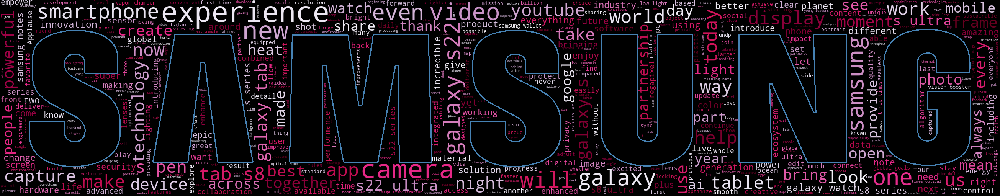

# Galaxy-Unpacked-February-2022-NLP
#  
 NLP for Samsung's 2022 february release.

# Link of the video 
https://youtu.be/KpTBm_fg-Wk

# Objectives
- Do NLP for the press release for the show.
- identify most frequently used words in the release.

# WordCloud
# 

# Frequency Count
## Term frequency
1. galaxy
2. samsung
3. s22
4. ...
#  
## Frequency count for n-grams (n = 2)
#  
top frequency item set:
1. the, galaxy
2. you, can
3. galaxy, s22
4. ...

